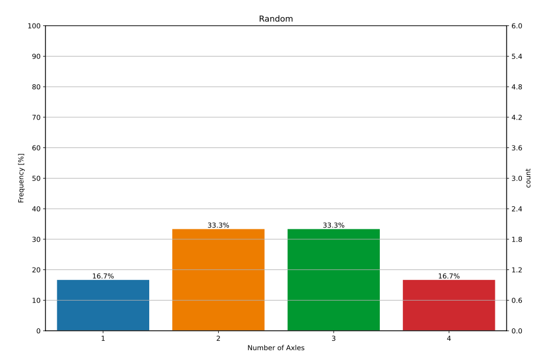

<p align="center">
  
</p>

[](https://www.python.org/)
[](https://lbesson.mit-license.org/)
[](https://pypi.org/project/soscipy/)
[](https://github.com/ellerbrock/open-source-badges/)
[](https://discord.gg/82bdR2pJ)
[](https://twitter.com/SaurabhKarn16)

<a href="https://twitter.com/intent/follow?screen_name=py_sci">
    
</a>

# SoSciPy
Social Science is hard, analysing data to make inferences should not be!
Project Soscipy is an attempt to enable social science researchers, economists, students, enthusiasts, data scientists and most importantly change makers do high quality data analysis and visualisation that works - easily.

There are four different parts to the library that talks to specific needs while working with data.
1. Data fetching
2. Data analysis
3. Data processing
4. Data visualisation
5. Utilities

## Setup
### With Pip
Install soscipy using pip by entering following command in the terminal: <br>
`pip install --upgrade soscipy`

or use following command inside Jupyter and Colab Notebooks <br>
`!pip install --upgrade soscipy`


#### 1. Data Analysis
**dat2csv:** A simple module to export data into a csv file


#### 2. Data processing
**Combine** Takes two dataframes as an input and exports a merged dataframe automatically. It figures out a primary key for the dataset and utilised TfIdf to match entities before merging

```
from socipy.process.dfops import combine
df = combine(df1,df2)
```

**Thin Panda:** A set of commonly used pandas functions such as renaming the columns etc.


**Parallelize:** A simple wrapper that takes a function and list of parameters and runs them in parallel to help you save the time and effort of dealing with more complicated multi-processing tools 


### 3. Data visualisation
**Plot:** Simple functions to quickly export visualised graphs
```
from kornect.plot import sns_cntplt_array
sns_cntplt_array([1,2,2,3,3,4],chart_title='Random chart',export=False) 
```


**istates:** Takes a dataframe with state names and values and plots a geomap of India for you as a PNG or GIF

**idistrict:** Takes a dataframe with district names and values and plots a geomap of India for you as a PNG or GIF

### 4. Utilities
**Browser:** Creates a selenium browser for you
**Update Progress:** This takes a float as an input and creates a beautiful progress bar and shows you the percentage. No added libraries just pure python implementation.


